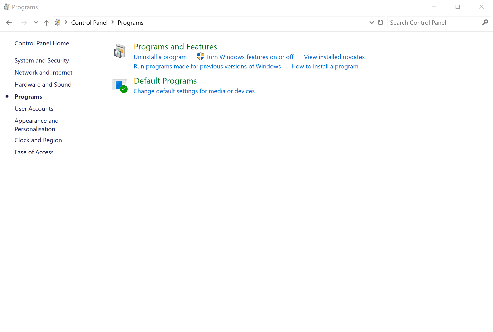
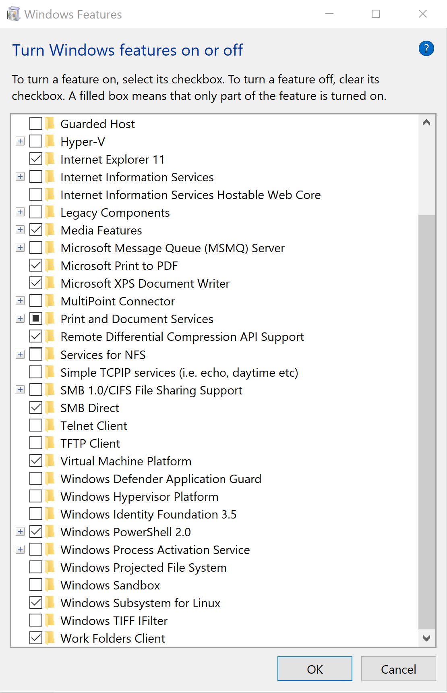
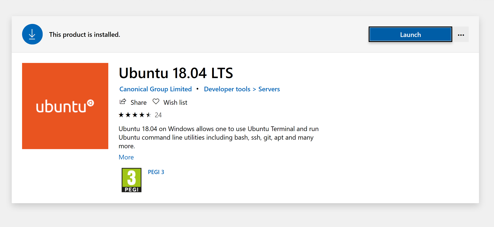
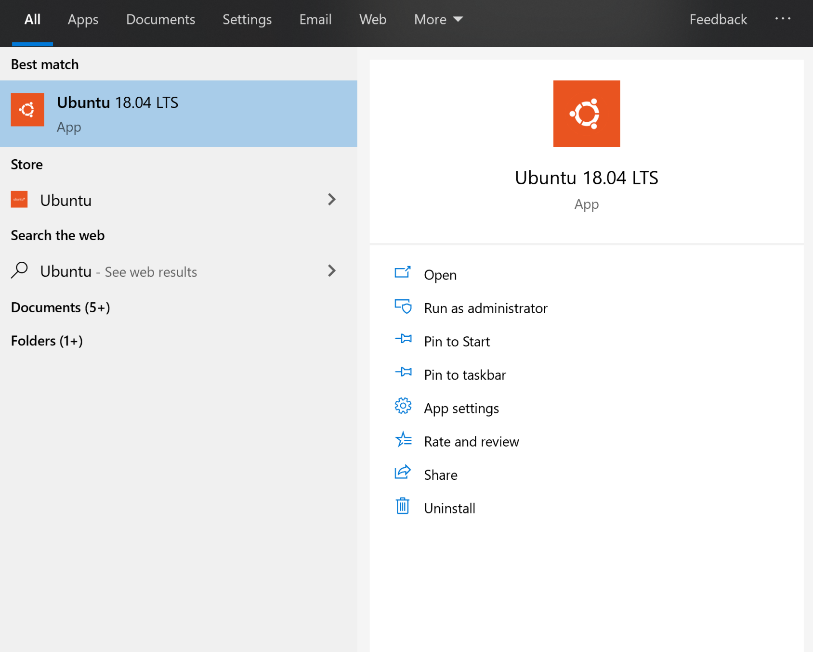

# Install Ubuntu 18.04 in Windows Subsystem For Linux 2 in Windows 10

1. Go to Control Panel -> Programs and click Windows features on or off.

1. Tick 'Virtual Machine Platform' and Windows Subsystem for Linux.

1. Restart your computer when prompted.

1. Go to Microsoft Store and search for Ubuntu 18.04.

1. Run Ubuntu 18.04.

1. You will be asked to create a user and password. Feel free to use the same credentials as
your Windows user (offline) or create a new one.
